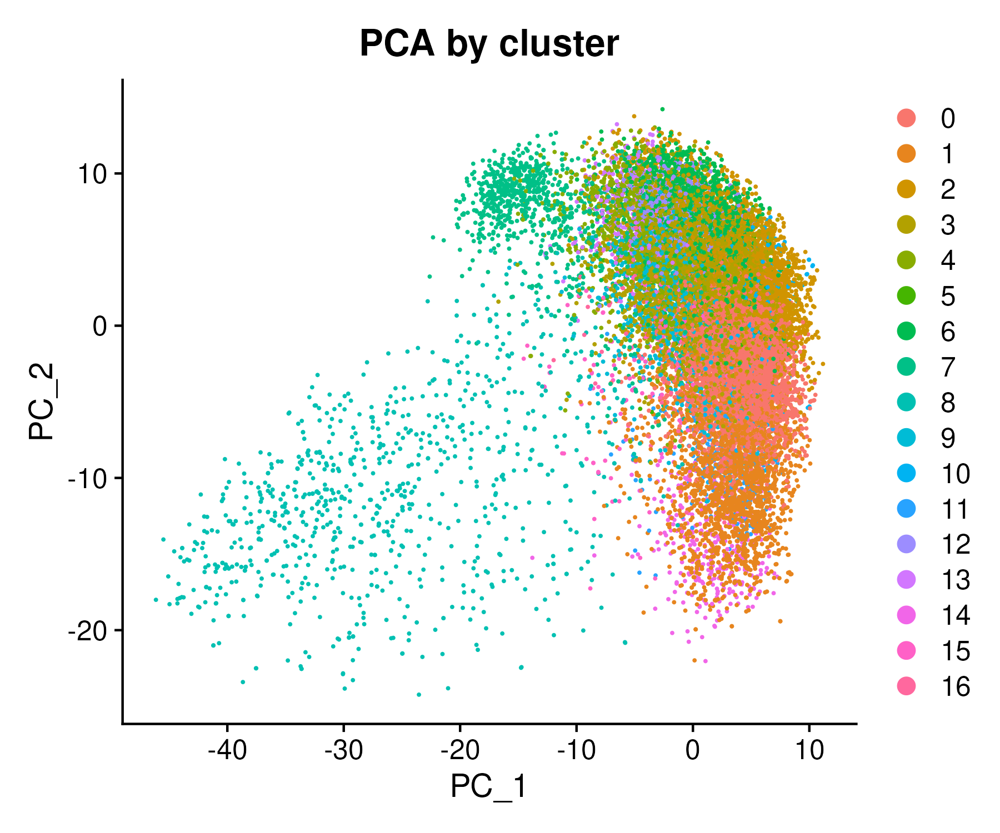
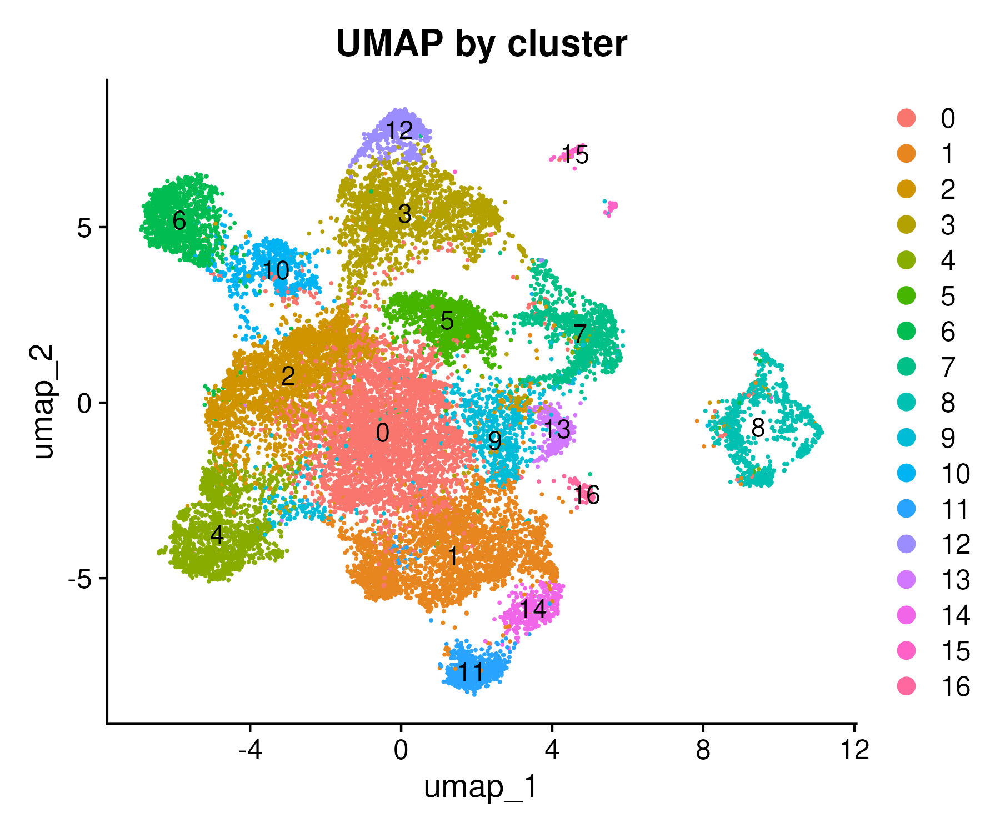
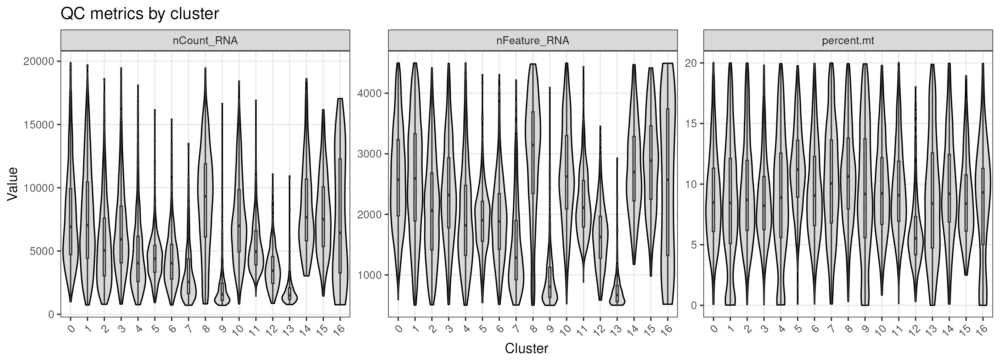
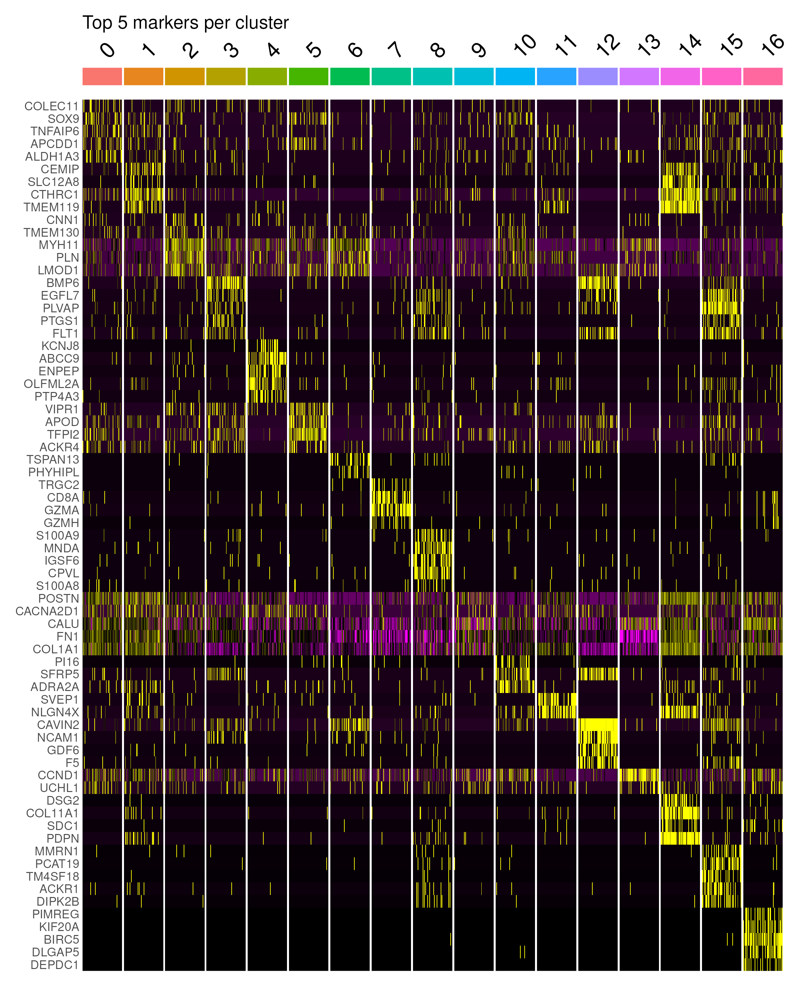
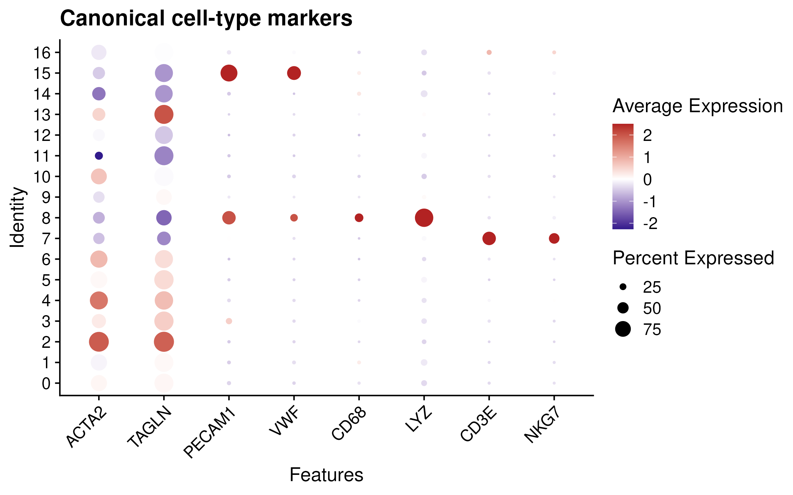
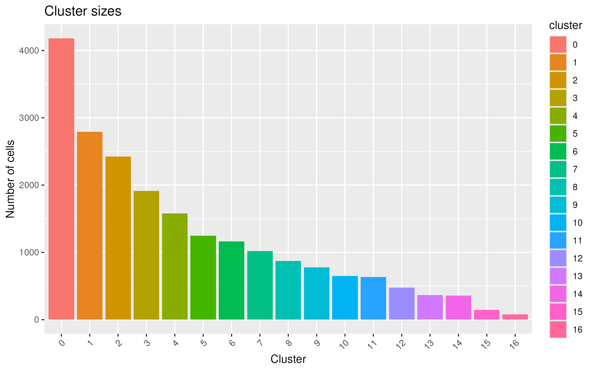

# Overview

This analysis applies a fully reproducible scRNA-seq workflow to human carotid endarterectomy samples. The dataset contains a collection of vascular and immune cells, and the analysis is executed entirely within a Docker-controlled environment using scripted preprocessing, dimensionality reduction, clustering, and figure generation. This structure ensures computational reproducibility, version consistency, and transparency while also allowing biologically informed interpretation of the resulting clusters.

All figures included here were generated by the script: carotid_analysis.R and saved under the `figures/` directory.

---

# Data Summary

The dataset includes multiple cell populations known to contribute to carotid plaque biology, including smooth muscle cells (SMCs), endothelial cells, macrophages, monocytes, T cells, and NK cells. From a data-science perspective, the high-dimensional, zero-inflated transcriptomic matrix poses typical single-cell challenges (i.e., sparsity, technical noise, and nonlinear transcriptional structure). To address these challenges I made use of a combination of PCA, UMAP, graph-based clustering, and differential expression testing.

---

# PCA

```{r echo=FALSE, out.width="100%"}

```

PCA provides an initial linear projection of gene expression variance and reveals broad separation among major cell lineages. The primary axes correspond to well-established biological programs: endothelial versus SMC identities, immune activation states, and metabolic or stress-related variation.

# UMAP 
```{r echo=FALSE, out.width="100%"}

```

UMAP refines the structure of the PCA, revealing clearly separated clusters consistent with contractile and synthetic SMCs, inflammatory macrophage subsets, endothelial populations, and distinct T/NK-cell activation states. These patterns reflect key features of atherosclerosis, including SMC phenotypic modulation, macrophage-driven inflammation, endothelial remodeling, and adaptive immune infiltration.

# Quality Control Metrics 
```{r echo=FALSE, out.width="100%"}

```

Quality control metrics contribute both technical and biological insight. While nFeature_RNA and nCount_RNA help identify differences in sequencing depth and cellular complexity, they also highlight biologically active cell states—macrophages with high transcriptional output or stressed cells with elevated mitochondrial proportions. 

# Cluster Marker Heatmap 
```{r echo=FALSE, out.width="100%"}

```

The  heatmap reinforces cluster identities by demonstrating distinct lineage-specific signatures. Contractile SMCs express ACTA2 and TAGLN, while fibroblast-like SMCs express extracellular matrix genes such as COL1A1 and FN1. Macrophage clusters express inflammatory markers including CD68, LYZ, and S100A8/A9, whereas endothelial clusters are characterized by PECAM1 and VWF. Cytotoxic lymphocyte clusters express NKG7 and GZMB, consistent with their immune effector functions. These markers not only confirm computational clustering but also map transcriptional states to known biological roles in plaque stability, inflammation, and remodeling..

# Canonical Market DotPlot 
```{r echo=FALSE, out.width="100%"}

```

The canonical marker dotplot provides a targeted, gene-centric view of the data. It answers the question: “Which clusters express specific lineage-defining marker genes, and to what degree?” Dot size indicates the fraction of cells in a cluster expressing a gene, while color indicates expression level among those expressing cells. This makes the dotplot ideal for confirming biological identity. SMC clusters show strong expression of ACTA2 and TAGLN, endothelial clusters show PECAM1 and VWF, macrophage clusters express CD68 and LYZ, and lymphocyte clusters express CD3E or NKG7. This figure evaluates marker expression patterns, not population abundance, and  validates the biological interpretation of the computational clustering.

# Cluster Size Summary 
```{r echo=FALSE, out.width="100%"}

```

This plot provides a quantitative overview of cluster abundance, reflecting both biological composition of the tissue and potential technical biases from dissociation or sequencing. Large macrophage clusters are expected in inflamed plaques, while SMC numbers inform fibrous cap stability. Smaller endothelial and lymphocyte clusters reflect their lower relative abundance in this tissue. From a data-science standpoint, cluster size distributions help verify clustering stability, detect rare populations, and identify potential over- or under-clustering.

# Conclusions 

Together, these analyses illustrate how single-cell data-science tools can dissect the cellular architecture of human vascular disease. They demonstrate both the computational rigor of a structured, reproducible workflow and the biological richness of plaque ecosystems shaped by SMC remodeling, macrophage activation, endothelial dysfunction, and immune infiltration. This integrative approach provides a strong foundation for more advanced analyses such as trajectory inference, regulatory network mapping, or cross-dataset integration.

